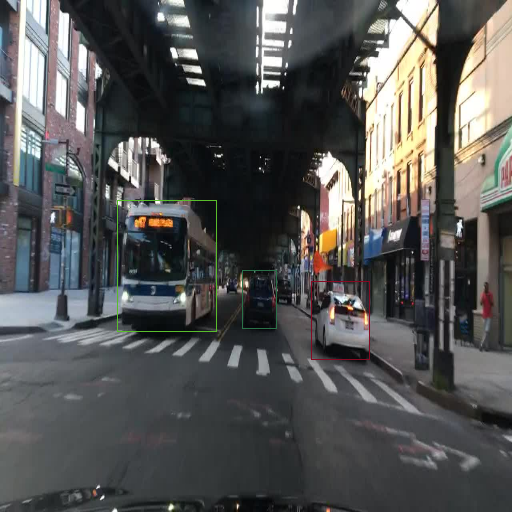
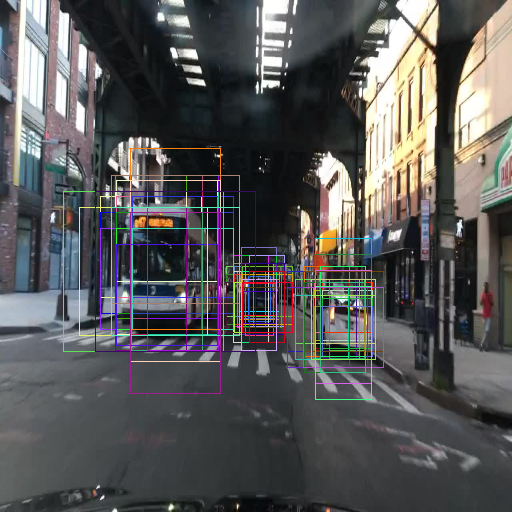

# RetinaNet - Focal Loss for Dense Object Detection

## Progress Tracker
 - [x] Implement data input pipeline with tf.data
 - [x] Implement train and validation steps
 - [ ] Add random_flip
 - [ ] Train on BDD dataset
 - [ ] Add inference code
 - [ ] Publish results
 - [ ] Add support for video inference
 - [ ] Code clean up & refactoring
