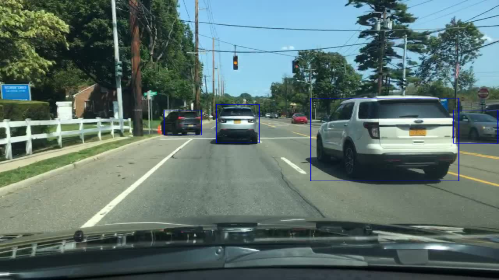
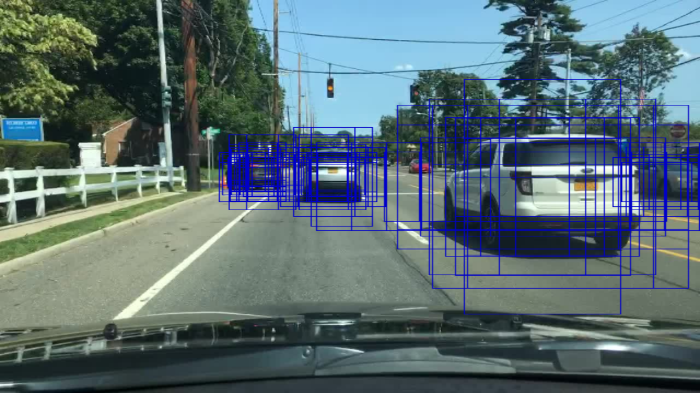

# RetinaNet - Focal Loss for Dense Object Detection

## Progress Tracker
 * [x] Implement data input pipeline with tf.data
 * [x] Implement train and validation steps
 * [x] Add random_flip
 * [x] TPU support
 * [ ] LR schedule and handle large batches (TPU)
 * [ ] Train on BDD dataset
 * [x] Add inference code
 * [ ] Publish results
 * [ ] Add support for video inference
 * [ ] Code clean up & refactoring
# WORK IN PROGESSS, check /tpu/tpu_train.ipynb for latest updates
